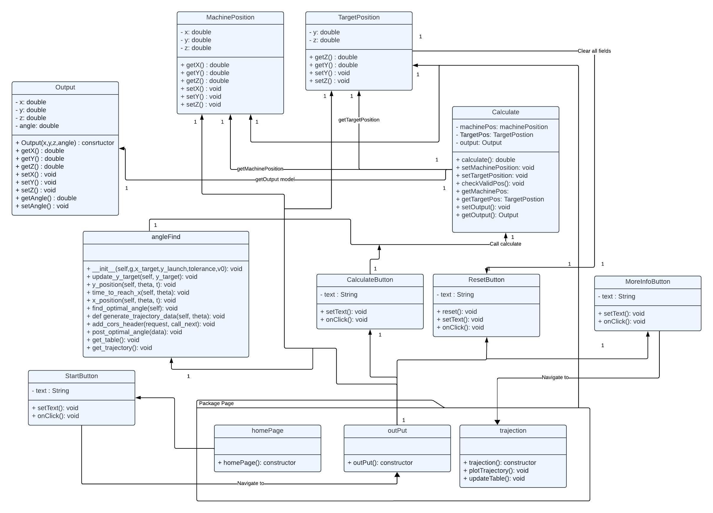

## Introduction

This web application is designed to calculate and visualize optimal angles and trajectories based on machine and target positions. The application is built with a front-end user interface, a FastAPI-based backend, and Google Sheets for data storage. The following sections provide an overview of each component and the interactions between them.

## Front End

The front end of the application is a graphical user interface (GUI) with various interactive elements, such as buttons, text boxes, and text areas. The main pages and components include:

- **Home Page**: The landing page of the application where users can navigate to different functionalities.
- **Output Page**: Displays the calculated results and output data.
- **Trajectory Page**: Visualizes the calculated trajectory based on the provided data.

### GUI Elements

- **Start Button**: Initiates the calculation process.
- **Calculate Button**: Triggers the calculation of optimal angles.
- **Reset Button**: Clears all input fields and resets the application state.
- **More Info Button**: Provides additional information about the calculations and results.

## API Endpoints

The backend of the application is powered by FastAPI, which handles the computation and data retrieval. The API endpoints include:

- **POST /data**: Accepts `TargetData` and returns an `OptimalAngleResponse`.
    ```python
    @app.post("/data", response_model=OptimalAngleResponse)
    async def post_optimal_angle(data: TargetData):
        # Implementation here
    ```

- **GET /table**: Retrieves data from the Google Sheet and returns it in a tabular format.
    ```python
    @app.get("/table")
    async def get_table():
        # Implementation here
    ```

- **GET /data**: Retrieves the trajectory data.
    ```python
    @app.get("/data")
    async def get_trajectory():
        # Implementation here
    ```

- **GET /get**: Retrieves the optimal angle calculation.
    ```python
    @app.get("/get")
    async def get_optimal_angle():
        # Implementation here
    ```

## Back End

The backend is responsible for processing the data and performing the necessary calculations. It interacts with the front end via API endpoints and uses Google Sheets for data storage. The key components include:

- **Machine Position**: Holds the current position of the machine.
- **Target Position**: Holds the desired target position.
- **Calculate**: Computes the optimal angles and trajectories based on the machine and target positions.
- **Output**: Stores and provides access to the calculation results.

## Data Storage

Google Sheets is used to store and manage the data for the application. It allows for easy access and manipulation of the data required for calculations and visualizations.

Grid Search Algorithm
The application uses a Grid Search algorithm to determine the optimal angle for the given machine and target positions.

What is Grid Search?
Grid Search is an exhaustive search algorithm used to find the optimal parameters for a model. It works by systematically working through multiple combinations of parameter values, cross-validating as it goes to determine which combination provides the best results.

How Grid Search is Applied
In this application, the Grid Search algorithm iterates over a specified range of angles to find the best fit angle that meets the desired criteria. The steps are as follows:

Define the Parameter Grid: Specify the range of angles to be tested.
Iterate through Parameters: For each angle, perform the necessary calculations to determine its suitability.
Evaluate Results: Assess each angle based on predefined metrics to determine its effectiveness.
Select Best Angle: Choose the angle that provides the best results according to the evaluation metrics.
This process ensures that the most optimal angle is selected based on comprehensive evaluation across a range of possibilities.
## UML Diagram

The following UML diagram provides a detailed overview of the classes and their relationships within the application:



## Conclusion

This README provides a high-level overview of the web application, including its front end, API endpoints, and back end. For more detailed information on the implementation and usage, please refer to the respective sections in the documentation.
"""

with open("/mnt/data/README.md", "w") as file:
    file.write(readme_content)


## How to run api go to path .path/studio/Js/
run this commard ion terminal :
: uvicorn anglefind:app --reload   
